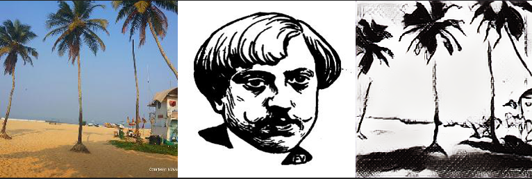

# 内容

- [风格迁移描述](#风格迁移描述)
- [模型架构](#模型架构)
- [数据集](#数据集)
- [预训练模型](#预训练模型)
- [实验环境要求](#实验环境要求)
- [脚本描述](#脚本描述)
    - [脚本和样例代码](#脚本和样例代买)
    - [脚本参数](#脚本参数)
    - [训练过程](#训练过程)
    - [Ascend310推理过程](#ascend310推理过程)
- [模型描述](#模型描述)
    - [效果](#效果)
        - [训练效果](#训练效果)  
        - [评估效果](#评估效果)
- [样例](#样例)
- [ModelZoo 主页](#modelzoo-homepage)

# [风格迁移描述](#内容)

本代码是对论文 [**Exploring the structure of a real-time, arbitrary neural artistic stylization network** ](https://arxiv.org/abs/1705.06830)在mindspore框架下的实现

作者: [Golnaz Ghiasi](https://arxiv.org/search/cs?searchtype=author&query=Ghiasi%2C+G), [Honglak Lee](https://arxiv.org/search/cs?searchtype=author&query=Lee%2C+H), [Manjunath Kudlur](https://arxiv.org/search/cs?searchtype=author&query=Kudlur%2C+M), [Vincent Dumoulin](https://arxiv.org/search/cs?searchtype=author&query=Dumoulin%2C+V), [Jonathon Shlens](https://arxiv.org/search/cs?searchtype=author&query=Shlens%2C+J)

在本文中，我们提出了一种结合神经算法的灵活性和快速风格迁移网络的速度的方法，允许使用任何内容/风格图像对进行实时风格化。通过学习直接从风格图像预测条件实例归一化参数，我们构建了基于多风格迁移网络的条件实例归一化的近期工作。该模型在大约8万幅画的语料库上成功训练，并能够归纳出以前未观察到的风格。证明了学习的嵌入空间是平滑的，包含丰富的结构，并以完全无监督的方式组织与绘画相关的语义信息。

# [模型架构](#内容)


风格预测网络P从输入的风格图像中预测一个嵌入向量S，该向量S为风格迁移网络提供一组归一化常数。风格迁移网络将图像转换成一种指定风格化的表现形式。内容损失和风格损失由VGG图像分类网络表示空间中的距离得到。风格预测网络很大程度上遵循了Inception-v3架构。

# [数据集](#内容)

为了训练风格迁移，使用了两个数据集:

- 内容数据集: [MS COCO](http://images.cocodataset.org/zips/train2014.zip)（[ImageNet](http://images.cocodataset.org/zips/train2014.zip) 数据集是论文原始使用的数据集）
- 风格数据集:  [Painter by Number dataset (PBN)](https://www.kaggle.com/c/painter-by-numbers) and [Describable Textures Dataset (DTD)](https://www.robots.ox.ac.uk/~vgg/data/dtd/).
  [PBN training](https://github.com/zo7/painter-by-numbers/releases/download/data-v1.0/train.tgz)
  [PBN testing](https://github.com/zo7/painter-by-numbers/releases/download/data-v1.0/test.tgz)
  [DTD dataset](https://www.robots.ox.ac.uk/~vgg/data/dtd/download/dtd-r1.0.1.tar.gz)

训练数据集：

- 内容数据集：[MS COCO](http://images.cocodataset.org/zips/train2014.zip)
- 风格数据集：[PBN training](https://github.com/zo7/painter-by-numbers/releases/download/data-v1.0/train.tgz)和[DTD dataset](https://www.robots.ox.ac.uk/~vgg/data/dtd/download/dtd-r1.0.1.tar.gz),，将两个数据集的图片直接放到一个文件夹中

测试数据集：

- 内容数据集：任意的自己收集的图片或者从MS COCO中自己选一些图像
- 风格数据集：任意的自己收集的风格化的图像或者[PBN testing](https://github.com/zo7/painter-by-numbers/releases/download/data-v1.0/test.tgz)

# [预训练模型](#内容)

Style Transfer Networks的训练过程需要预先训练的VGG16和Inception-v3
[VGG16 pretrained model](https://download.mindspore.cn/model_zoo/r1.2/vgg16_ascend_v120_imagenet2012_official_cv_bs32_acc73/) 和 [Inception-v3 pretrained model](https://download.mindspore.cn/model_zoo/r1.2/inceptionv3_ascend_v120_imagenet2012_official_cv_bs128_acc78/)。

将下载后的预训练模型重命名为inceptionv3.ckpt 和 vgg16.ckpt。

下载完预训练模型后，请将其放在'../pretrained_model'文件夹中。

# [实验环境要求](#内容)

- 硬件 Ascend
    - 准备Ascend处理器硬件环境.
- 框架
    - [MindSpore](https://www.mindspore.cn/install/en)
- 欲了解更多信息，请查看以下资源:
    - [MindSpore Tutorials](https://www.mindspore.cn/tutorials/en/master/index.html)
    - [MindSpore Python API](https://www.mindspore.cn/docs/en/master/index.html)

# [脚本描述](#内容)

## [脚本和样例代码](#内容)

```shell
style transfer

├─ README.md # 风格迁移描述
├── scripts  
 ├─ run_distribute_train.sh # 运行分布式训练 (8 Acsend)
 ├─ run_eval.sh # 进行评估
 └─ run_stranalone_train.sh # 运行单Acsend训练(1 Acsend)
├─── dataset # 数据集
 ├── train # 内容和风格训练数据集
  ├─ content
  └─ style
 └── test # 内容和风格测试数据集
  ├─ content
  └─ style
├── pretrained_model  
 ├─ vgg16.ckpt # VGG16 预训练模型
 └─ inceptionv3.ckpt # Inception-v3 预训练模型
├── src  
 ├─ ckpt # 保存 ckpt  
 ├─ testdataset.py # 加载测试数据集  
 ├─ traindataset.py # 加载训练数据集
 ├─ loss.py # 定义的风格迁移损失函数
 ├─ model.py # 定义的风格迁移模型和训练过程
 ├─ networks.py # 子网络的定义  
 ├─ vgg16.py # vgg16 网络的定义  
 └─ inceptionv3py # inception-v3 网络的定义  
├─ output # 输出结果的文件夹
├─ test.py # 模型测试代码
├─ train.py # 模型训练代码
├─ export_for_310.py # 为310推理导出模型
└─ ascend310_infer # 310推理程序
```

## [脚本参数](#内容)

### [训练脚本参数](#内容)

```shell
# 分布式训练 Ascend
bash ./scripts/run_distribute_train_ascend.sh [RANK_TABLE_FILE] [PLATFORM] [CONTENT_PATH] [STYLE_PATH] [CKPT_PATH]
# 分布式训练 GPU
bash ./scripts/run_distribute_train_gpu.sh [CONTENT_PATH] [STYLE_PATH] [CKPT_PATH]

# 单Ascend/GPU训练
bash ./scripts/run_standalone_train.sh [PLATFORM] [DEVICE_ID] [CONTENT_PATH] [STYLE_PATH] [CKPT_PATH]
```

### [训练结果](#内容)

训练结果将存储在“./src/ckpt”中。你可以找到训练好的模型文件。

### [评估脚本参数](#内容)

- 运行 `run_eval.sh` 脚本来评估模型.

```bash
# 评估
bash ./scripts/run_eval.sh [PLATFORM] [DEVICE_ID] [CONTENT_PATH] [STYLE_PATH] [INCEPTION_CKPT] [CKPT_PATH]
```

### [评估结果](#内容)

评估结果将存储在输出中。在那里，你可以找到风格转换图片。

## [Ascend310推理过程](#内容)

### 导出 MINDIR 文件

```bash
python  export_for_310.py --ckpt_file [/path/to/ckpt_file] --inception_ckpt [/path/to/inception_ckpt]
```

### Ascend310推理

- 运行 `run_infer_310.sh` 以进行310推理.

```bash
# 310推理
bash run_infer_310.sh [MINDIR_PATH] [CONTENT_PATH] [STYLE_PATH] [DEVICE_ID]
# 示例
bash run_infer_310.sh ./style_transfer_model.mindir ./content_test/ ./style_test/ 0
```

风格化图片将存储在 postprocess_Result 文件夹中.

# [模型描述](#内容)

## [效果](#内容)

### 训练效果

| 参数             |                                                              |
| ---------------- | ------------------------------------------------------------ |
| 模型版本         | v1                                                           |
| 环境             | Ascend / GPU(Tesla V100-PCIE 32G)；CPU：2.60GHz 52cores ；RAM：754G |
| MindSpore 版本   | 1.3.0                                                        |
| 数据集           | 内容数据集: MS COCO. 风格数据集: PBN training and DTD dataset |
| 训练参数         | epoch=100,  batch_size = 16                                  |
| 优化器           | Adam                                                         |
| 损失函数         | content loss and  style loss                                 |
| 输出             | 风格迁移图片                                                 |
| 精度             | 主观评价                                                     |
| 性能             | 1 Ascend: 392ms/step; 8 Ascend: 303ms/step; 1 GPU: 560ms/step; 8 GPU：582ms/step |
| 总时间           | 1 Ascend: 56h20m21s; 8 Ascend: 6h15m40s; 8 GPU:11h30m        |
| 训练好的模型大小 | 71.27M (.ckpt file)                                          |
| 脚本             |                                                              |

### 测试效果

| 参数           | 单Ascend / GPU                               |
| -------------- | -------------------------------------------- |
| 模型版本       | v1                                           |
| 环境           | Ascend                                       |
| MindSpore 版本 | 1.3.0                                        |
| 数据集         | 内容数据集: MS COCO. 风格数据集: PBN testing |
| batch_size     | 1                                            |
| Speed          | GPU: 342ms/step;                             |
| 输出           | 风格迁移图片                                 |

# [样例](#内容)

## 风格迁移结果



## 风格迁移插值结果


# [ModelZoo 主页](#内容)

请点击进入官方[主页](https://gitee.com/mindspore/models).
